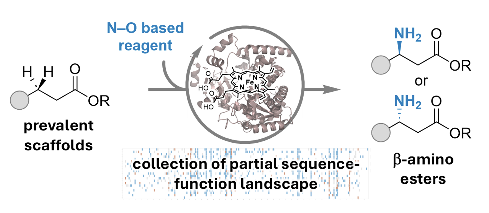

## Code for: A Chemoselective and Stereodivergent Platform of Heme-Nitrene Transferases to Access Chiral Aryl-β-Amino Esters and Investigation of the Sequence-Activity Landscape

This repo contains the code and analysis to reproduce the data mining and figures that were generated from the paper above. Here we profiled the sequence function landscape across a classical directed evolution campaign for two new to nature reactivities. 

For both of these partial landscapes were collected, capturing fitness data across 190 positions (data to be released with publication). The analysis is aimed to be simple and uses the LevSeq sequnecing platform (https://github.com/fhalab/LevSeq).




## Quick Start

Install required libraries:

``` 
conda create --name analysis python=3.10 -y
pip install jupyterlab scipy pandas tqdm numpy matplotlib seaborn Levenshtein sciutil biopython
jupyter lab
````

## Run notebooks


SFig8-9_ProcessLevSeq.ipynb should be run if you want to process the raw data from the LevSeq campaign.  

SFig10-11_LevSeq_Results_PaperFigs.ipynb is to create the landscape figure for the campaign and then also do to the data analysis and selection of variants across the campaign.  

SFig12_VariantDataAcrossCampaign.ipynb is to look at specific positions across the entire campaign (i.e. a more targetted analysis to see where else did the specific variants appear.)

Fig4_SingleVariantValidation.ipynb is just a figure of the results from the experiments of the ones that were successful from the data mining approach.

## Data

Data will be made publicly available on zenodo on publishing of release: https://zenodo.org/uploads/16969555

## Citation

coming soon.


